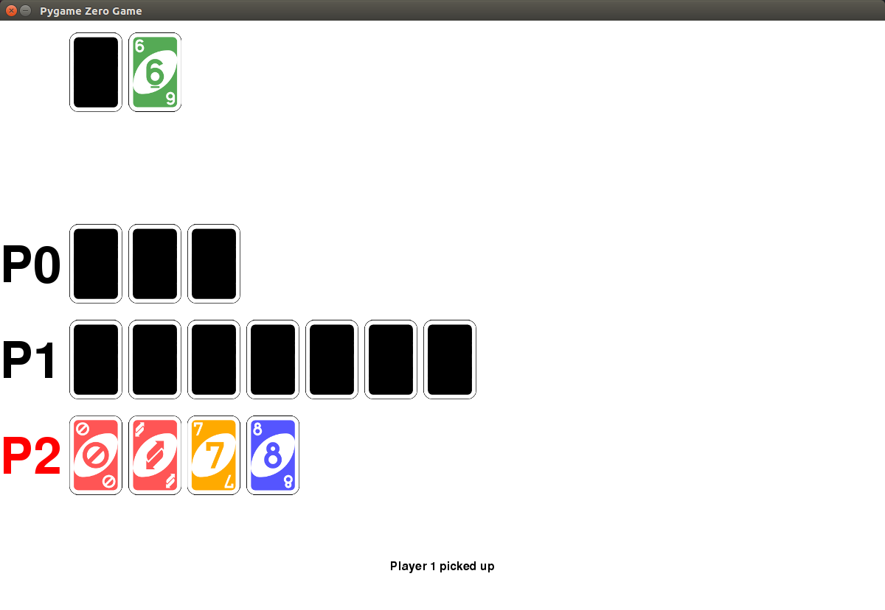

# Uno

Some unit tested Python code to model the card game Uno

## Rules

https://en.wikipedia.org/wiki/Uno_(card_game)#Official_rules

Uno is a card game based on a deck of cards. There is a description of these cards here:
https://www.unorules.org/how-many-cards-in-uno/

For the purposes of this coursework, please ignore the blank cards.
There is a basic tutorial on how the game works here:
https://www.youtube.com/watch?v=sWoSZmHsCls

and there is a more detailed description here:
https://www.unorules.org

In addition to those rules, your game should include one further rule. At the beginning of each turn, 
before playing any card, the player must choose one card from their hand, put it on the bottom of the 
discard pile, and then take the top card from the draw pile and put it in their hand.

There is a rule in the game that the player should shout “Uno” once they have one card in their hand, 
and if they forget to do so, an opponent can shout this instead. Implementing this rule is not necessary 
in this variant of the game, though you could implement it as an extension.

Your program will be simulating a single round of the game, i.e. playing until one of the players is left 
without cards. Once the game round ends, you need to show the scores of each player (based on the 
cards they still have). You do not need to implement a scoring mechanism for playing multiple game 
rounds as playing multiple rounds of the game is not a compulsory part of the task.
Some versions of the game include Swap Hands and Shuffle Hands cards. Implementing these is not 
necessary in this variant of the game, though you could implement them as an extension.
## Usage

An example auto-generated game of 5 players:

```python
from uno import UnoGame, COLORS
import random

game = UnoGame(5)

while game.is_active:
    player = game.current_player
    player_id = player.player_id
    if player.can_play(game.current_card):
        for i, card in enumerate(player.hand):
            if game.current_card.playable(card):
                if card.color == 'black':
                    new_color = random.choice(COLORS)
                else:
                    new_color = None
                print("Player {} played {}".format(player, card))
                game.play(player=player_id, card=i, new_color=new_color)
                break
    else:
        print("Player {} picked up".format(player))
        game.play(player=player_id, card=None)
```

See [random_game.py](random_game.py)

## AI

A simple interactive AI version of the game can be played using keyboard inputs. Just create an instance of `AIUnoGame` with the required number of players:

```python
from uno import AIUnoGame

game = AIUnoGame(5)
```

You will be assigned a player number at random, and will be asked to make your move when it is your turn. Enter card numbers as a zero-based index, and colours as lowercase strings. (I'll tidy that up later)

## Graphical game

A graphical version of the game can be played, developed using [pygame-zero](http://pygame-zero.readthedocs.io/).



Install pygame zero with:

```bash
sudo pip3 install pgzero
```

And run the game with:

```bash
pgzrun uno_pgz.py
```
